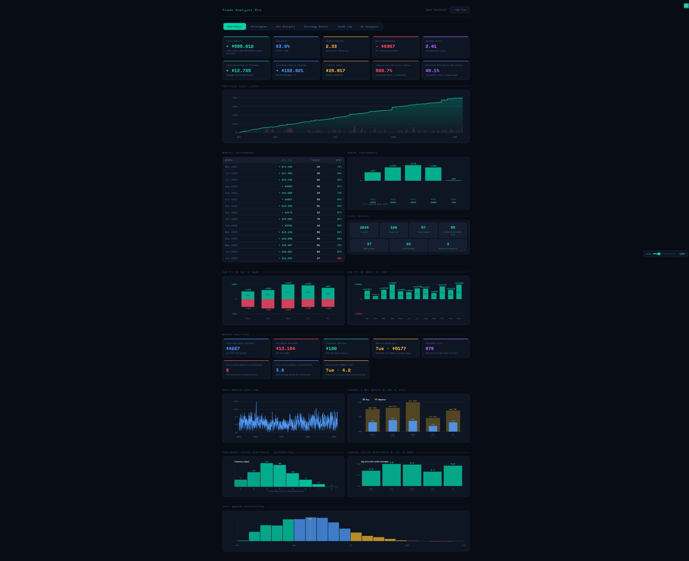
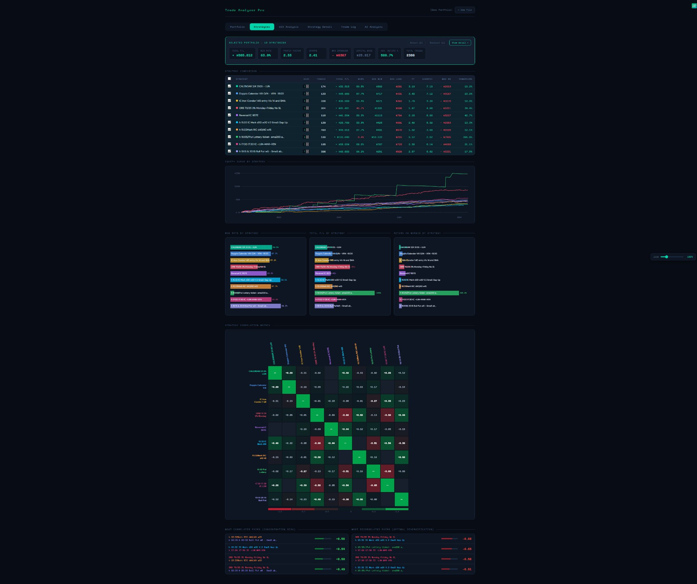
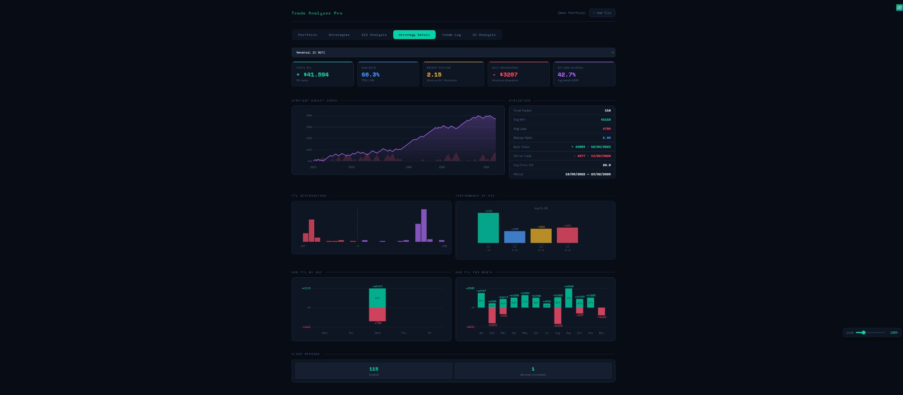
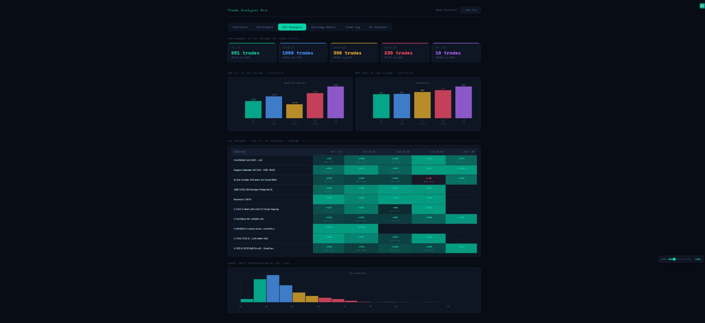

# Trade Analyzer Pro 📊

> **Free, open-source portfolio analytics tool for SPX options traders — powered by AI**

---

## What is this?

Trade Analyzer Pro is a **single-file HTML application** that transforms your Option Omega CSV exports into deep portfolio insights. No installation, no server, no data sent anywhere — everything runs locally in your browser.

Built by a retail trader, for retail traders.

---

## Features

### 📈 Portfolio Analytics
- Full equity curve with drawdown visualization
- Monthly P&L table with win rate breakdown
- Annual performance chart
- Capital base calculation (max daily margin + 2× max drawdown)
- Annualized return on capital

### 🎯 Strategy Comparison
- Per-strategy metrics: Sharpe, Win Rate, Profit Factor, Max DD, Return on Margin
- **Size multiplier** — scale each strategy independently and see real-time impact on portfolio metrics
- Correlation matrix across all strategies
- Sub-portfolio mode — select any strategy subset and analyze it in full detail

### 🌊 VIX Regime Analysis
- Performance breakdown across VIX bands (< 15, 15–20, 20–25, 25–30, 30+)
- Identify which strategies thrive or suffer in high-volatility regimes
- Day-of-week performance patterns

### 💰 Margin Analytics
- Daily margin exposure over time
- Max & average concurrent open strategies
- Concurrent strategy distribution histogram
- Day-of-week margin and strategy count averages
- **0DTE handling**: margin for same-day trades is automatically set to Max Loss (no leverage)

### 🤖 AI-Powered Insights (Claude API)
- Full portfolio analysis with customizable depth (concise / detailed / expert)
- Focused analysis modes: strategy comparison, VIX exposure, risk management, improvement suggestions
- **Portfolio Optimizer**: generates 3 optimized portfolio proposals (max Sharpe / max return / max robustness) with strategy selection and size recommendations
- One-click load of AI-suggested portfolios into the selector

---

## How to Use

### Option 1 — Use Online (recommended)
👉 **[Open Live Demo](https://sax-optionomega.github.io/Trade-Analyzer)**

1. Export your trades from Option Omega as CSV
2. Drag & drop the file into the app
3. Explore your portfolio analytics

### Option 2 — Run Locally
Download `trade_analyzer.html` and open it with the included launcher:

- **Windows**: double-click `Apri_TradeAnalyzer.bat` (opens Chrome with CORS disabled)
- **Mac/Linux**: run `./avvia_server.sh` (starts a local server)

> The local launchers are needed only for the AI analysis feature. All other features work directly from `file://`.

---

## AI Analysis Setup

The app connects directly to the [Anthropic Claude API](https://www.anthropic.com) from your browser.

1. Get your API key at [console.anthropic.com/settings/keys](https://console.anthropic.com/settings/keys)
2. Make sure your account has credits at [console.anthropic.com/settings/billing](https://console.anthropic.com/settings/billing) — a $5 top-up is more than enough to start
3. Open the **AI Analysis** tab and paste your key in the API Key field
4. The key is stored only in your browser's memory — never sent anywhere except directly to Anthropic

> ⚠️ **The AI feature does NOT work if you open the HTML file by double-clicking it.** Use the [live demo](https://sax-optionomega.github.io/Trade-Analyzer) or a local server instead (see Troubleshooting below).

---

## Troubleshooting

### `[!] Connection failed` or `Failed to fetch` on AI Analysis

This is a **CORS browser security restriction** — browsers block API calls made from local files (`file://` protocol).

**Easiest fix:** use the online version:
👉 [https://sax-optionomega.github.io/Trade-Analyzer](https://sax-optionomega.github.io/Trade-Analyzer)

If it still fails on GitHub Pages, check:
- Your API key starts with `sk-ant-api03-...`
- Your Anthropic account has credits (check [billing](https://console.anthropic.com/settings/billing))

### Running locally with AI enabled

**Windows:** double-click `Apri_TradeAnalyzer.bat`

**Mac/Linux:** run `./avvia_server.sh` then open `http://localhost:8080`

**VS Code:** install the [Live Server](https://marketplace.visualstudio.com/items?itemName=ritwickdey.LiveServer) extension → right-click the file → *Open with Live Server*

---

## Data & Privacy

- **No backend** — your CSV data never leaves your browser
- **No installation** — single HTML file, ~140KB
- **Analytics** — the app uses Google Analytics to count visits (pageviews only, no personal data)
- When you trigger AI analysis, your portfolio statistics are sent to the Anthropic API using your own API key

---

## Supported Data Format

Exported CSV from **[Option Omega](https://optonomega.com)** with the following columns:

`Date Opened · Time Opened · Date Closed · Time Closed · Strategy · P/L · P/L % · Margin Req. · Max Loss · No. of Contracts · Opening VIX · Closing VIX · Reason For Close · Opening Price · Closing Price · Premium · Max Profit · Legs`

---

## Screenshots

### Portfolio Overview

### Strategy Comparison & Correlation Matrix

### VIX Regime Analysis

### Strategy Detail

---

## Coming Soon — Dynamic Portfolio Optimizer

The next version of Trade Analyzer Pro will include **dynamic portfolio optimization**: automatically selecting and weighting your Option Omega strategies based on VIX regime, rolling Sharpe, correlation, and market conditions.

Instead of analyzing a fixed portfolio, you'll define a pool of strategies and let the system tell you which ones to run today — and in what proportion.

👉 **[Join the waitlist](https://docs.google.com/forms/d/e/1FAIpQLSf-FkBSWFW1DuAekiaYs5b4AqVt9iBJBdW4V3c4rwdSP3IjFA/viewform?usp=header)** to be notified first and help shape the direction of the tool.

---

## Roadmap
- [ ] Multi-account / multi-broker CSV support
- [ ] Export analysis as PDF report
- [ ] Strategy performance alerts
- [ ] Position sizing calculator
- [ ] More automation tools *(in development)*

---

## License

MIT License — free to use, modify and distribute.

---

## Author

Built with ❤️ by a retail SPX options trader.  
Questions, suggestions, feedback → open an [Issue](../../issues) or reach out on Telegram.

> *This tool is for informational and educational purposes only. Nothing here constitutes financial advice.*
