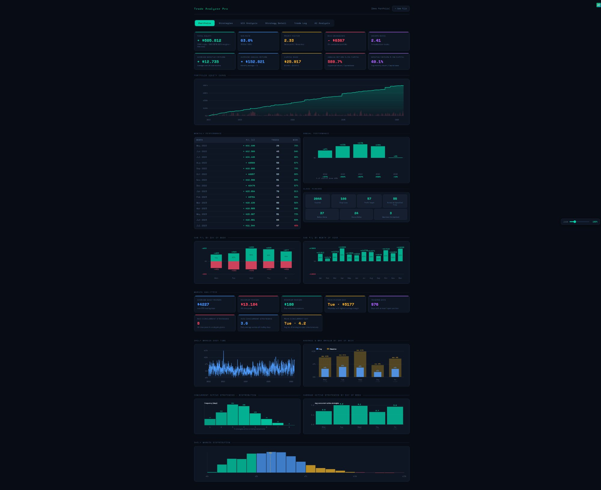
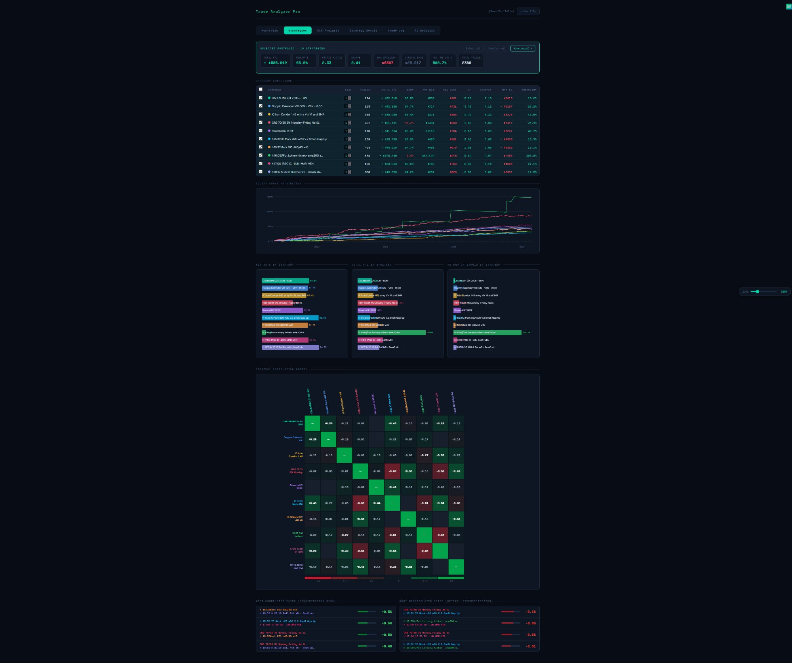
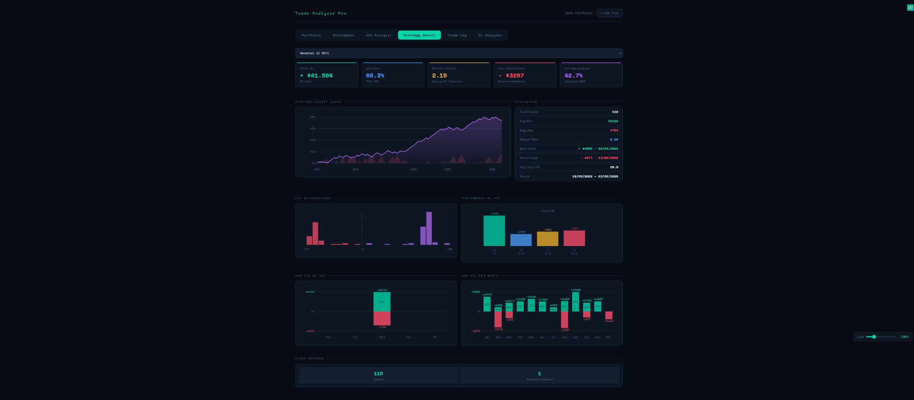
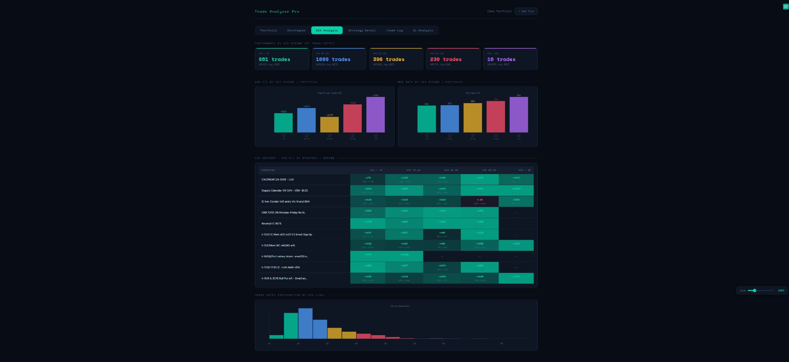

# Trade Analyzer Pro 📊

> **Free, open-source portfolio analytics tool for SPX options traders — powered by AI**

---

## What is this?

Trade Analyzer Pro is a **single-file HTML application** that transforms your Option Omega CSV exports into deep portfolio insights. No installation, no server, no data sent anywhere — everything runs locally in your browser.

Built by a retail trader, for retail traders.

---

## Features

### 📈 Portfolio Analytics
- Full equity curve with drawdown visualization
- Monthly P&L table with win rate breakdown
- Annual performance chart
- Capital base calculation (max daily margin + 2× max drawdown)
- Annualized return on capital

### 🎯 Strategy Comparison
- Per-strategy metrics: Sharpe, Win Rate, Profit Factor, Max DD, Return on Margin
- **Size multiplier** — scale each strategy independently and see real-time impact on portfolio metrics
- Correlation matrix across all strategies
- Sub-portfolio mode — select any strategy subset and analyze it in full detail

### 🌊 VIX Regime Analysis
- Performance breakdown across VIX bands (< 15, 15–20, 20–25, 25–30, 30+)
- Identify which strategies thrive or suffer in high-volatility regimes
- Day-of-week performance patterns

### 💰 Margin Analytics
- Daily margin exposure over time
- Max & average concurrent open strategies
- Concurrent strategy distribution histogram
- Day-of-week margin and strategy count averages
- **0DTE handling**: margin for same-day trades is automatically set to Max Loss (no leverage)

### 🔬 Rolling Window Portfolio Optimizer
- **End Date + Months Back**: select an end date and a free-form look-back period (any number of months) to define the optimization window
- **8 fitness functions**: Sharpe, Equity (Total P&L), Win %, Min Max DD, Risk/Reward (Profit Factor), R² (equity linearity), Expectancy (Win% × Avg Win/Loss), Win% Trend (penalizes recent decay)
- **Smart pre-filtering**: strategies are individually evaluated — those below the **Min Fitness** threshold or with too few trades are eliminated before combination search
- **Scan Fitness button**: instantly shows every strategy's individual fitness score with min/avg/median/max stats, so you can calibrate the Min Fitness threshold before running
- **Min Trades filter**: skip strategies with fewer than N trades in the window (default 20) to reduce overfitting
- **Min/Max Strategies**: set portfolio size bounds (min can be 0 — if all strategies are below threshold, the period is skipped)
- Brute-force evaluation of all strategy combinations and size allocations
- Ranked results with full metrics: Calmar, Sortino, Profit Factor, Win Rate, Max DD
- **Out-of-sample validation**: metrics computed on data outside the optimization window
- Interactive equity curve showing both in-sample and out-of-sample performance
- Configurable: max strategies per portfolio, max size multiplier, number of top results

### 🔄 Walk-Forward Backtest
- **Sliding window optimization**: trains on N months, trades the best portfolio for M days, then slides forward and repeats until end of data
- **Dual resolution**: test period ≥ 28 days uses monthly windows; < 28 days automatically switches to weekly resolution for finer granularity
- Uses the same fitness function and **pre-filtering** as the optimizer (Min Trades per strategy, Min Fitness threshold)
- **Min Fitness regime filter**: if no strategy combination exceeds the Min Fitness threshold in a train window, the test period is skipped — the system stays flat until conditions improve
- **Strategy selection frequency chart**: horizontal bar chart showing how often each strategy was selected across all WF steps
- **Trade-level equity curve** with drawdown visualization — shows every individual trade, not monthly sums
- Per-step detail table with train/test windows, selected portfolio, train score, test P&L, and cumulative P&L (skipped steps shown in muted style)
- **Comprehensive OOS statistics**: Sharpe, Sortino, Calmar, R², Profit Factor, Win Rate, Max DD, Avg Trade, Avg Win/Loss, Max Consecutive Win/Loss
- **Best/Worst month and week** statistics
- **Monthly P&L heatmap**: year × month grid with green/red coloring, annual totals, and monthly averages
- Progress bar with real-time step-by-step status updates
- **Greedy fast path**: O(S×P) optimization for Win%/Win% Trend in weekly mode with size=1
- **Optimizer Presets**: save/load named parameter configurations (stored in localStorage) — quickly switch between different optimization setups

### 🤖 AI-Powered Insights (Multi-Provider)
- **4 AI providers supported**: Claude (Anthropic), GPT-4o (OpenAI), Gemini (Google), Groq
- Automatic **model fallback**: if a model is unavailable, the app tries up to 3 alternatives per provider
- Full portfolio analysis with customizable depth (concise / detailed / expert)
- Focused analysis modes: strategy comparison, VIX exposure, risk management, improvement suggestions
- **Portfolio Optimizer**: generates 3 optimized portfolio proposals (max Sharpe / max return / max robustness) with strategy selection and size recommendations
- One-click load of AI-suggested portfolios into the selector
- **Export AI reports** as `.MD` (Markdown) or `.TXT` files with one click

---

## How to Use

### Option 1 — Use Online (recommended)
👉 **[Open Live Demo](https://sax-optionomega.github.io/Trade-Analyzer)**

1. Export your trades from Option Omega as CSV
2. Drag & drop the file into the app
3. Explore your portfolio analytics

### Option 2 — Run Locally
Download `trade_analyzer.html` and open it with the included launcher:

- **Windows**: double-click `Apri_TradeAnalyzer.bat` (opens Chrome with CORS disabled)
- **Mac/Linux**: run `./avvia_server.sh` (starts a local server)

> The local launchers are needed only for the AI analysis feature. All other features work directly from `file://`.

---

## AI Analysis Setup

The app supports **4 AI providers** — choose the one you prefer:

| Provider | Where to get your API key | Notes |
|---|---|---|
| **Claude** (Anthropic) | [console.anthropic.com/settings/keys](https://console.anthropic.com/settings/keys) | Recommended for depth of analysis |
| **GPT-4o** (OpenAI) | [platform.openai.com/api-keys](https://platform.openai.com/api-keys) | Widely used, solid all-rounder |
| **Gemini** (Google) | [aistudio.google.com/app/apikey](https://aistudio.google.com/app/apikey) | Free tier available |
| **Groq** | [console.groq.com/keys](https://console.groq.com/keys) | Free, ultra-fast responses |

1. Get an API key from any provider above
2. Open the **AI Analysis** tab, select your provider, and paste the key
3. The key is stored only in your browser's memory — never sent anywhere except directly to the provider's API

If a model is temporarily unavailable, the app automatically tries fallback models within the same provider.

> ⚠️ **The AI feature does NOT work if you open the HTML file by double-clicking it.** Use the [live demo](https://sax-optionomega.github.io/Trade-Analyzer) or a local server instead (see Troubleshooting below).

---

## Troubleshooting

### `[!] Connection failed` or `Failed to fetch` on AI Analysis

This is a **CORS browser security restriction** — browsers block API calls made from local files (`file://` protocol).

**Easiest fix:** use the online version:
👉 [https://sax-optionomega.github.io/Trade-Analyzer](https://sax-optionomega.github.io/Trade-Analyzer)

If it still fails on GitHub Pages, check:
- Your API key format matches the selected provider (e.g. `sk-ant-...` for Claude, `sk-...` for OpenAI, `AIza...` for Gemini, `gsk_...` for Groq)
- Your account has credits available with the selected provider

### Running locally with AI enabled

**Windows:** double-click `Apri_TradeAnalyzer.bat`

**Mac/Linux:** run `./avvia_server.sh` then open `http://localhost:8080`

**VS Code:** install the [Live Server](https://marketplace.visualstudio.com/items?itemName=ritwickdey.LiveServer) extension → right-click the file → *Open with Live Server*

---

## Data & Privacy

- **No backend** — your CSV data never leaves your browser
- **No installation** — single HTML file, ~140KB
- **Analytics** — the app uses Google Analytics to count visits (pageviews only, no personal data)
- When you trigger AI analysis, your portfolio statistics are sent to the selected AI provider's API using your own API key

---

## Supported Data Format

Exported CSV from **[Option Omega](https://optonomega.com)** with the following columns:

`Date Opened · Time Opened · Date Closed · Time Closed · Strategy · P/L · P/L % · Margin Req. · Max Loss · No. of Contracts · Opening VIX · Closing VIX · Reason For Close · Opening Price · Closing Price · Premium · Max Profit · Legs`

---

## Screenshots

### Portfolio Overview

### Strategy Comparison & Correlation Matrix

### VIX Regime Analysis

### Strategy Detail

---

## Roadmap
- [x] Rolling window portfolio optimizer with custom date range
- [x] Walk-forward backtest with trade-level equity curve
- [x] 8 fitness functions including Expectancy and Win% Trend
- [x] Scan Fitness tool for threshold calibration
- [x] Min Fitness regime filter (skip bad periods)
- [x] Optimizer presets (save/load named configurations)
- [x] Weekly resolution mode for short test periods
- [ ] AI-powered strategy selection based on current market conditions
- [ ] Strategy automation tools *(in development — [join waitlist](https://docs.google.com/forms/d/e/1FAIpQLSf-FkBSWFW1DuAekiaYs5b4AqVt9iBJBdW4V3c4rwdSP3IjFA/viewform?usp=header))*

---

## License

MIT License — free to use, modify and distribute.

---

## Author

Built with ❤️ by a retail SPX options trader.  
Questions, suggestions, feedback → open an [Issue](../../issues) or reach out on Telegram.

> *This tool is for informational and educational purposes only. Nothing here constitutes financial advice.*
